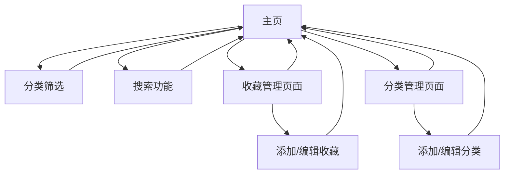

# 个人收藏快速导航网站产品需求文档

## 1. 产品概述
个人收藏快速导航网站是一个帮助用户管理和快速访问个人收藏链接的Web应用。用户可以通过分类管理功能组织收藏内容，通过搜索和筛选功能快速定位所需链接，提升个人网络资源管理效率。

该产品旨在解决用户收藏链接分散、难以管理和快速查找的问题，为个人用户提供一个集中化、高效的收藏管理平台。

## 2. 核心功能

### 2.1 用户角色
本产品为单用户应用，无需复杂的用户角色区分。

### 2.2 功能模块
个人收藏导航网站需求包含以下主要页面：
1. **主页**：分类展示区域、收藏链接展示区域、搜索功能、快速操作按钮
2. **分类管理页面**：分类列表、分类创建/编辑表单、分类删除确认
3. **收藏管理页面**：收藏链接添加/编辑表单、收藏详情展示

### 2.3 页面详情

| 页面名称 | 模块名称 | 功能描述 |
|----------|----------|----------|
| 主页 | 分类导航栏 | 展示所有分类标签，支持点击筛选对应收藏链接 |
| 主页 | 收藏展示区 | 以卡片形式展示收藏链接，包含标题、描述、图标和访问链接 |
| 主页 | 搜索功能 | 提供关键词搜索，支持按标题和描述搜索收藏内容 |
| 主页 | 快速操作 | 提供添加收藏、管理分类的快捷入口 |
| 分类管理页面 | 分类列表 | 展示所有分类，显示分类名称、收藏数量、操作按钮 |
| 分类管理页面 | 分类表单 | 创建和编辑分类，包含分类名称、颜色标识、描述等字段 |
| 分类管理页面 | 删除确认 | 删除分类前的确认对话框，提示影响的收藏数量 |
| 收藏管理页面 | 收藏表单 | 添加和编辑收藏链接，包含标题、URL、描述、分类选择、图标等字段 |
| 收藏管理页面 | 收藏预览 | 实时预览收藏链接的展示效果 |

## 3. 核心流程

**主要用户操作流程：**
1. 用户访问主页，浏览现有分类和收藏链接
2. 通过分类筛选或搜索功能快速定位目标收藏
3. 点击收藏链接直接访问目标网站
4. 通过快速操作按钮添加新的收藏或管理分类
5. 在分类管理页面创建、编辑或删除分类
6. 在收藏管理页面添加、修改或删除收藏链接

## 4. 用户界面设计

### 4.1 设计风格
- **主色调**：#2563eb（蓝色）作为主色，#f8fafc（浅灰）作为背景色
- **辅助色**：#10b981（绿色）用于成功状态，#ef4444（红色）用于警告状态
- **按钮样式**：圆角按钮设计，hover效果明显
- **字体**：系统默认字体，标题使用16-20px，正文使用14px
- **布局风格**：卡片式布局，顶部导航栏设计
- **图标风格**：使用简洁的线性图标，支持收藏网站favicon展示

### 4.2 页面设计概览

| 页面名称 | 模块名称 | UI元素 |
|----------|----------|--------|
| 主页 | 分类导航栏 | 水平标签栏，支持滚动，活跃状态高亮显示 |
| 主页 | 收藏展示区 | 网格布局卡片，每个卡片包含图标、标题、描述和快速操作按钮 |
| 主页 | 搜索功能 | 顶部搜索框，带搜索图标，支持实时搜索提示 |
| 分类管理页面 | 分类列表 | 表格形式展示，包含颜色标识、名称、数量统计和操作按钮 |
| 分类管理页面 | 分类表单 | 模态框形式，包含名称输入、颜色选择器、描述文本域 |
| 收藏管理页面 | 收藏表单 | 分步表单设计，URL自动获取标题和图标，分类下拉选择 |

### 4.3 响应式设计
采用移动优先的响应式设计策略，支持桌面端、平板和手机端访问。在移动端优化触摸交互体验，调整卡片布局和按钮大小以适应不同屏幕尺寸。