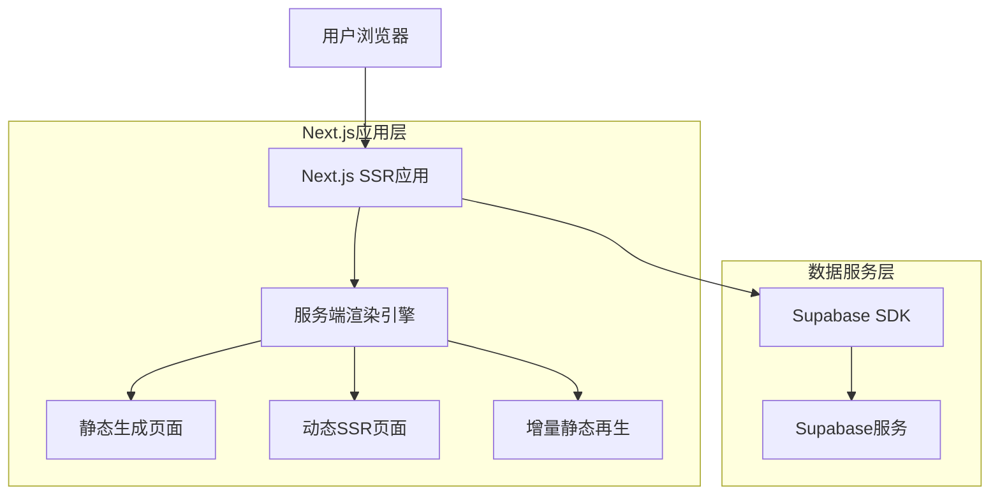
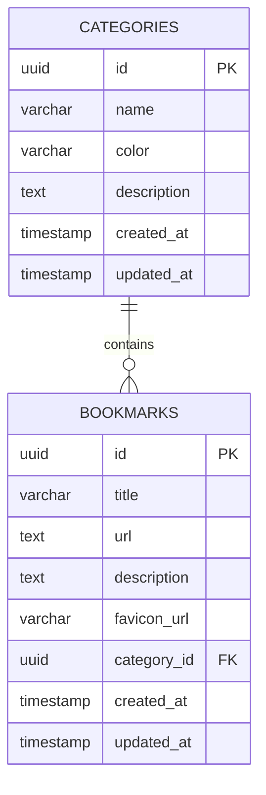

# 个人收藏快速导航网站技术架构文档

## 1. 架构设计



### 1.1 SSR架构优势

* **SEO优化**：服务端渲染确保搜索引擎能够完整抓取页面内容，提升搜索排名

* **首屏性能**：减少客户端JavaScript执行时间，提升首屏加载速度至1.5秒以内

* **用户体验**：避免页面闪烁和加载状态，提供更流畅的用户体验

* **社交分享**：支持动态生成Open Graph标签，优化社交媒体分享效果

* **缓存策略**：结合CDN和服务端缓存，实现毫秒级页面响应

## 2. 技术描述

* 前端：Next.js\@14 + TypeScript + Tailwind CSS\@3（支持SSR和静态生成）

* 渲染策略：服务端渲染（SSR）+ 静态站点生成（SSG）混合模式

* 后端：Supabase（提供数据库、认证、实时订阅等服务）

* 数据库：Supabase PostgreSQL

* 部署：Vercel（Next.js原生支持，自动优化SSR性能）

### 2.1 页面渲染策略

* **主页（/）**：SSR - 实时获取最新收藏数据，确保内容时效性

* **分类管理页面**：SSR - 动态加载分类数据，支持实时更新

* **收藏详情页面**：SSG + ISR - 静态生成提升性能，增量静态再生保证数据新鲜度

* **搜索页面**：CSR - 客户端渲染支持实时搜索交互

* **API路由**：服务端处理，支持SSR数据预取

## 3. 路由定义

| 路由                    | 文件路径                              | 渲染方式      | 用途              |
| --------------------- | --------------------------------- | --------- | --------------- |
| /                     | app/page.tsx                      | SSR       | 主页，服务端渲染最新收藏数据  |
| /categories           | app/categories/page.tsx           | SSR       | 分类管理页面，动态获取分类数据 |
| /bookmarks/new        | app/bookmarks/new/page.tsx        | CSR       | 添加新收藏页面，客户端交互   |
| /bookmarks/edit/\[id] | app/bookmarks/edit/\[id]/page.tsx | SSR       | 编辑收藏页面，预加载收藏数据  |
| /bookmarks/\[id]      | app/bookmarks/\[id]/page.tsx      | SSG + ISR | 收藏详情页，静态生成优化性能  |
| /search               | app/search/page.tsx               | CSR       | 搜索结果页面，支持实时搜索   |

### 3.1 SSR数据获取策略

* 使用`async/await`在服务端组件中直接调用Supabase

* 实现`generateMetadata`函数动态生成SEO标签

* 利用Next.js缓存机制优化重复数据请求

## 4. API定义

### 4.1 SSR数据获取函数

**服务端组件数据获取**

```typescript
// app/page.tsx - 主页SSR数据获取
export default async function HomePage() {
  const { data: categories } = await supabase.from('categories').select('*')
  const { data: bookmarks } = await supabase.from('bookmarks').select('*')
  
  return <HomePageComponent categories={categories} bookmarks={bookmarks} />
}

// 动态生成页面元数据
export async function generateMetadata(): Promise<Metadata> {
  return {
    title: '个人收藏导航 - 快速访问您的收藏网站',
    description: '高效管理和快速访问个人收藏链接的导航网站'
  }
}
```

### 4.2 SSR配置说明

**Next.js配置文件（next.config.js）**

```javascript
/** @type {import('next').NextConfig} */
const nextConfig = {
  // 启用实验性功能
  experimental: {
    serverActions: true,
    serverComponentsExternalPackages: ['@supabase/supabase-js']
  },
  // 图片优化配置
  images: {
    domains: ['supabase.co', 'github.com'],
    formats: ['image/webp', 'image/avif']
  },
  // 缓存配置
  headers: async () => [
    {
      source: '/api/:path*',
      headers: [
        { key: 'Cache-Control', value: 's-maxage=60, stale-while-revalidate' }
      ]
    }
  ]
}

module.exports = nextConfig
```

**ISR配置示例**

```typescript
// app/bookmarks/[id]/page.tsx
export const revalidate = 3600 // 1小时重新验证

export async function generateStaticParams() {
  const { data: bookmarks } = await supabase.from('bookmarks').select('id')
  return bookmarks?.map(bookmark => ({ id: bookmark.id })) || []
}
```

### 4.3 核心API路由

**分类管理相关**

获取所有分类

```
GET /api/categories
```

响应：

| 参数名称            | 参数类型   | 描述        |
| --------------- | ------ | --------- |
| id              | string | 分类唯一标识    |
| name            | string | 分类名称      |
| color           | string | 分类颜色标识    |
| description     | string | 分类描述      |
| bookmark\_count | number | 该分类下的收藏数量 |
| created\_at     | string | 创建时间      |

**收藏管理相关**

获取收藏列表

```
GET /api/bookmarks
```

请求参数：

| 参数名称         | 参数类型   | 是否必需  | 描述    |
| ------------ | ------ | ----- | ----- |
| category\_id | string | false | 按分类筛选 |
| search       | string | false | 搜索关键词 |
| limit        | number | false | 分页限制  |
| offset       | number | false | 分页偏移  |

响应：

| 参数名称         | 参数类型   | 描述      |
| ------------ | ------ | ------- |
| id           | string | 收藏唯一标识  |
| title        | string | 收藏标题    |
| url          | string | 收藏链接    |
| description  | string | 收藏描述    |
| favicon\_url | string | 网站图标URL |
| category\_id | string | 所属分类ID  |
| created\_at  | string | 创建时间    |

创建收藏

```
POST /api/bookmarks
```

请求：

| 参数名称         | 参数类型   | 是否必需  | 描述     |
| ------------ | ------ | ----- | ------ |
| title        | string | true  | 收藏标题   |
| url          | string | true  | 收藏链接   |
| description  | string | false | 收藏描述   |
| category\_id | string | true  | 所属分类ID |

## 5. 数据模型

### 5.1 数据模型定义



### 5.2 数据定义语言

**分类表（categories）**

```sql
-- 创建分类表
CREATE TABLE categories (
    id UUID PRIMARY KEY DEFAULT gen_random_uuid(),
    name VARCHAR(100) NOT NULL,
    color VARCHAR(7) DEFAULT '#2563eb',
    description TEXT,
    created_at TIMESTAMP WITH TIME ZONE DEFAULT NOW(),
    updated_at TIMESTAMP WITH TIME ZONE DEFAULT NOW()
);

-- 创建索引
CREATE INDEX idx_categories_name ON categories(name);

-- 设置权限
GRANT SELECT ON categories TO anon;
GRANT ALL PRIVILEGES ON categories TO authenticated;

-- 初始化数据
INSERT INTO categories (name, color, description) VALUES
('工作学习', '#2563eb', '工作和学习相关的网站收藏'),
('娱乐休闲', '#10b981', '娱乐和休闲相关的网站收藏'),
('工具软件', '#f59e0b', '实用工具和软件相关的网站收藏'),
('技术开发', '#8b5cf6', '编程和技术开发相关的网站收藏');
```

**收藏表（bookmarks）**

```sql
-- 创建收藏表
CREATE TABLE bookmarks (
    id UUID PRIMARY KEY DEFAULT gen_random_uuid(),
    title VARCHAR(200) NOT NULL,
    url TEXT NOT NULL,
    description TEXT,
    favicon_url VARCHAR(500),
    category_id UUID REFERENCES categories(id) ON DELETE CASCADE,
    created_at TIMESTAMP WITH TIME ZONE DEFAULT NOW(),
    updated_at TIMESTAMP WITH TIME ZONE DEFAULT NOW()
);

-- 创建索引
CREATE INDEX idx_bookmarks_category_id ON bookmarks(category_id);
CREATE INDEX idx_bookmarks_title ON bookmarks(title);
CREATE INDEX idx_bookmarks_created_at ON bookmarks(created_at DESC);

-- 全文搜索索引
CREATE INDEX idx_bookmarks_search ON bookmarks USING gin(to_tsvector('english', title || ' ' || COALESCE(description, '')));

-- 设置权限
GRANT SELECT ON bookmarks TO anon;
GRANT ALL PRIVILEGES ON bookmarks TO authenticated;

-- 初始化数据
INSERT INTO bookmarks (title, url, description, category_id) 
SELECT 
    'GitHub', 
    'https://github.com', 
    '全球最大的代码托管平台', 
    id 
FROM categories WHERE name = '技术开发';

INSERT INTO bookmarks (title, url, description, category_id) 
SELECT 
    'Google', 
    'https://google.com', 
    '全球最大的搜索引擎', 
    id 
FROM categories WHERE name = '工作学习';
```

**更新时间触发器**

```sql
-- 创建更新时间函数
CREATE OR REPLACE FUNCTION update_updated_at_column()
RETURNS TRIGGER AS $$
BEGIN
    NEW.updated_at = NOW();
    RETURN NEW;
END;
$$ language 'plpgsql';

-- 为表添加更新时间触发器
CREATE TRIGGER update_categories_updated_at BEFORE UPDATE ON categories
    FOR EACH ROW EXECUTE FUNCTION update_updated_at_column();

CREATE TRIGGER update_bookmarks_updated_at BEFORE UPDATE ON bookmarks
    FOR EACH ROW EXECUTE FUNCTION update_updated_at_column()
```

